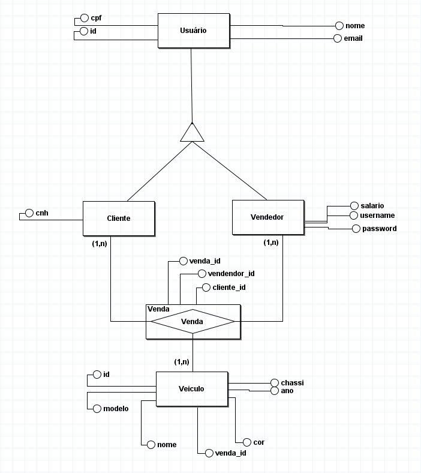

# API_Concessionaria

* Professor: 
  * [Daniel Faustino](https://github.com/danieltidus)
* Alunos: 
	* [João Heitor](https://github.com/Joao-Heitor)
	* [Vinicius Lins](https://github.com/VLV01)
## Introdução
Desenvolvimento de uma API como projeto final para a disciplina de **Desenvolvimento de Software Corporativo**, seguindo os padrões RestFul, sendo desenvolvida com spring Boot e com tema concessionária de veículos, com possibilidade de realizar operações com os usuários (CRUD) e vendas de veículos.

### Requisitos Levantados

* Cadastrar usuário
* Atualizar usuário
* Apagar usuário
* Definir privilégios de usuários (Vendedor e Cliente)
* Listar usuários
* Consultar usuário
* Venda de veículo
* Cadastrar veículo
* Deletar veículo
* Atualizar veículo
* Listar veículos
* Consultar veículo

### Modelo entidade relacionamento


### Rotas da API por Controllers

### Métodos
Requisições para a API devem seguir os padrões:

| Método | Descrição |
|---|---|
| `GET` | Retorna informações de um ou mais registros. |
| `POST` | Utilizado para criar um novo registro. |
| `PUT` | Atualiza dados de um registro ou altera sua situação. |
| `DELETE` | Remove um registro do sistema. |

### Respostas

| Código | Descrição |
|---|---|
| `200` | Requisição executada com sucesso (success).|
| `400` | Erros de validação ou os campos informados não existem no sistema.|
| `401` | Dados de acesso inválidos.|
| `404` | Registro pesquisado não encontrado (Not found).|

#### Controller Cliente
* POST: /api/cliente

    ```
    {
      "CNH": "",
      "id": "",
      "nome": "",
      "cpf": "",
      "email": ""
    }
    ```
* GET: /api/clientes

    ```
    [{
      "CNH": "",
      "id": "",
      "nome": "",
      "cpf": "",
      "email": ""
    },
    {
      "CNH": "",
      "id": "",
      "nome": "",
      "cpf": "",
      "email": ""
    }]
    ```
* GET: /api/cliente/{clienteId}"

    ```
    {
      "CNH": "",
      "id": "",
      "nome": "",
      "cpf": "",
      "email": ""
    }
    ```
* PUT: /api/cliente/{clienteId}

    ```
    {
      "CNH": "",
      "id": "",
      "nome": "",
      "cpf": "",
      "email": ""
    }
    ```
* DELETE: /api/cliente/{clienteId}
  ```
  {
    "CNH": "",
    "id": "",
    "nome": "",
    "cpf": "",
    "email": ""
  }
  ```

#### Controller Vendedor
* POST: /api/vendedor
  ```
  {
    "salario": "",
    "id": "",
    "nome": "",
    "cpf": "",
    "email": ""
  }
  ```
* GET: /api/vendedores
  ```
  [{
    "salario": "",
    "id": "",
    "nome": "",
    "cpf": "",
    "email": ""
  },
  {
    "salario": "",
    "id": "",
    "nome": "",
    "cpf": "",
    "email": ""
  }]
  ```
* GET: /api/vendedor/{vendedorId}
  ```
    {
      "salario": "",
      "id": "",
      "nome": "",
      "cpf": "",
      "email": ""
    }
    ```
* PUT: /api/vendedor/{vendedorId}
  ```
  {
    "salario": "",
    "id": "",
    "nome": "",
    "cpf": "",
    "email": ""
  }
  ```
* DELETE: /api/vendedor/{vendedorId}
  ```
  {
    "salario": "",
    "id": "",
    "nome": "",
    "cpf": "",
    "email": ""
  }
  ```


#### Controller Veículo
* POST: /api/veiculo
  ```
  {
    "id": "",
    "chassi": "",
    "modelo": "",
    "nome": "",
    "ano": "",
    "cor": ""
  }
  ```
* GET: /api/veiculos
  ```
  [{
    "id": "",
    "chassi": "",
    "modelo": "",
    "nome": "",
    "ano": "",
    "cor": ""
  },
  {
    "id": "",
    "chassi": "",
    "modelo": "",
    "nome": "",
    "ano": "",
    "cor": ""
  }]
  
  ```
* GET: /api/veiculos/{veiculoId}
  ```
  {
    "id": "",
    "chassi": "",
    "modelo": "",
    "nome": "",
    "ano": "",
    "cor": ""
  }
  ```
* PUT: /api/veiculos/{veiculoId}
  ```
  {
    "id": "",
    "chassi": "",
    "modelo": "",
    "nome": "",
    "ano": "",
    "cor": ""
  }
  ```
* DELETE: /api/veiculo/{veiculoId}
  ```
  {
    "id": "",
    "chassi": "",
    "modelo": "",
    "nome": "",
    "ano": "",
    "cor": ""
  }
  ```


#### Controller Venda
* POST: api/venda/vendedor/{vendedorId}/cliente/{clienteId}/veiculo/{veiculoId}
  ```
  {
    "vendaId": "",
    "veiculoId": "",
    "clienteId": "",
    "vendedorId": ""
  }
  ```

* GET: api/venda/vendedor/{vendedorId}/cliente/{clienteId}/veiculo/{veiculoId}
  ```
  [{
    "vendaId": "",
    "veiculoId": "",
    "clienteId": "",
    "vendedorId": ""
  },

  [{
  "vendaId": "",
  "veiculoId": "",
  "clienteId": "",
  "vendedorId": ""
  }]
  ```

* GET: api/venda/vendedor/{vendedorId}/cliente/{clienteId}/veiculo/{veiculoId}
  ```
  [{
    "vendaId": "",
    "veiculoId": "",
    "clienteId": "",
    "vendedorId": ""
  }
  ```
* GET: api/venda/vendedor/{vendedorId}/cliente/{clienteId}/veiculo/{veiculoId}
  ```
  {
    "vendaId": "",
    "veiculoId": "",
    "clienteId": "",
    "vendedorId": ""
  }
  ```
  * DELETE: api/venda/{vendaId}
  ```
  {
    "vendaId": "",
    "veiculoId": "",
    "clienteId": "",
    "vendedorId": ""
  }
  ```


